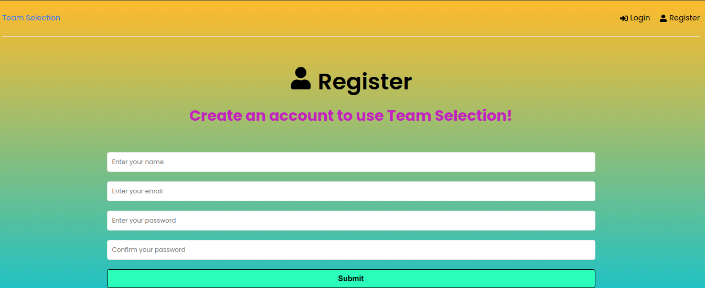
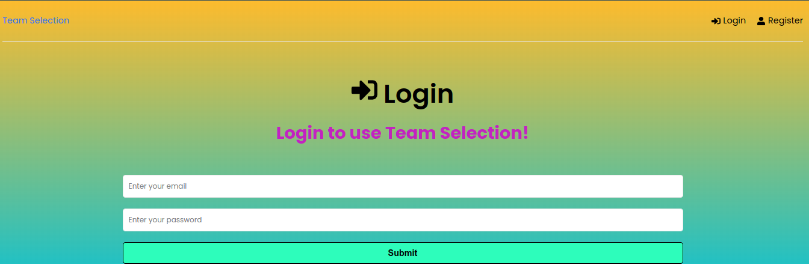
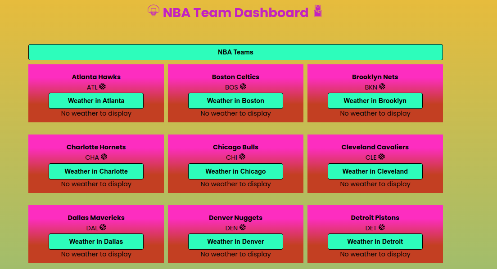
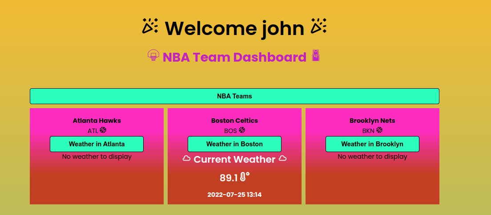

# Real-Synch-Assesment

<!-- ABOUT THE PROJECT -->
## Requirments

The completed app should enable the following user flow:
* The user presses a button to show a list of all NBA basketball teams. The list data should be obtained in realtime from the balldontlie API.
* The user is allowed to select one of the teams rendered in the previous step
* Upon selecting a team, the app uses the Weather API to display current weather info for the city where the team is located

## Built With

Built with the following:

* [React](https://reactjs.org/)
* [Node.js](https://nodejs.org/en/)
* [Express](https://expressjs.com/)
* [Redux](https://redux.js.org/)
* [MongoDB](https://www.mongodb.com/)
* [balldontlie API](https://www.balldontlie.io/#introduction)
* [Weather API](https://www.weatherapi.com/)

## Demo Photos
<h3> Registration </h3>

  

<h3> Login </h3>

  

<h3> Team Select </h3>

  

<h3> Current Weather </h3>

  

## Conclusion

#### Completed
* All requirments fufilled
* Backend routes for accessing api calls is protected
* JWT User Authentication

#### Future Considerations
* Front-end styling needs to be revised
* More time needed for redux configuration 
* Cache optimization 
* Specifically caching NBA teams (As functionality of app is dependent on selecting a team therefore no reason to continue requesting resource)
* Thoughts of caching weather lead to the realization if we want real time weather metrics we will need to make a new request each time

